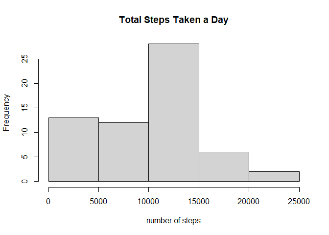
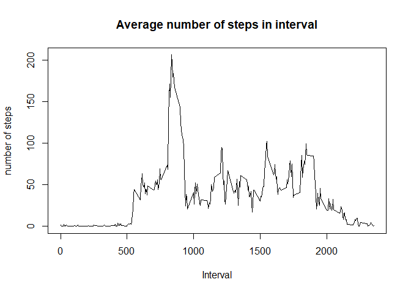
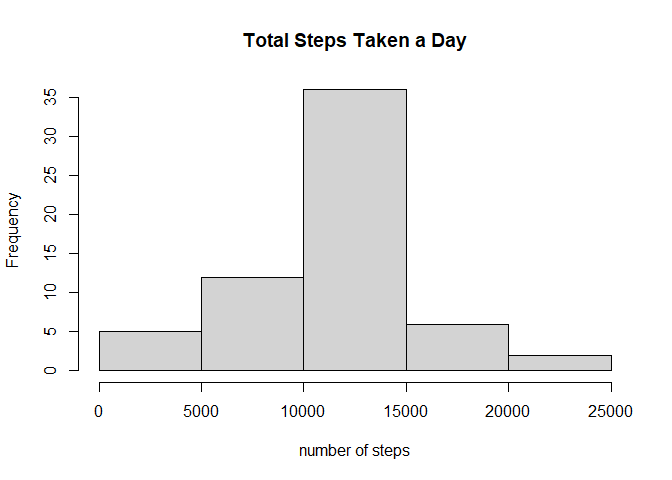

## Loading and preprocessing the data


```r
ActivityData <- read.csv(file = "Activity.csv")
ActivityData$date <- as.Date(ActivityData$date,format = "%Y-%m-%d")
ActivityData$steps <- as.numeric(ActivityData$steps)
```


## What is mean total number of steps taken per day?


```r
library(dplyr)
```

```
## Warning: package 'dplyr' was built under R version 4.0.2
```

```
## 
## Attaching package: 'dplyr'
```

```
## The following objects are masked from 'package:stats':
## 
##     filter, lag
```

```
## The following objects are masked from 'package:base':
## 
##     intersect, setdiff, setequal, union
```

```r
library(ggplot2)
```

```
## Warning: package 'ggplot2' was built under R version 4.0.2
```

```r
dailyTotal <- ActivityData %>% group_by(date) %>% 
  summarise(steps = sum(steps,na.rm=TRUE))
```

```
## `summarise()` ungrouping output (override with `.groups` argument)
```

```r
##chart the histogram of daily total steps
hist(dailyTotal$steps, main = "Total Steps Taken a Day", xlab = "number of steps")
```

<!-- -->

```r
##calculating the mean
mean(dailyTotal$steps)
```

```
## [1] 9354.23
```

```r
##calculating the median
median(dailyTotal$steps)
```

```
## [1] 10395
```

## What is the average daily activity pattern?


```r
##calculate the average number of steps in each 5 min interval & removing NAs
FiveMinSummary <- ActivityData %>% group_by(interval) %>%
  summarise(steps = mean(steps, na.rm = TRUE))
```

```
## `summarise()` ungrouping output (override with `.groups` argument)
```

```r
plot(FiveMinSummary$interval, FiveMinSummary$steps, type = "l", 
     main = "Average number of steps in interval", 
     xlab = "Interval", ylab = "number of steps")
```

<!-- -->

```r
##calculate the interval with the most steps on average
maxSteps <- which.max(FiveMinSummary$steps)
FiveMinSummary$interval[maxSteps]
```

```
## [1] 835
```


## Imputing missing values

```r
##Merge the data to fill in the NAs with the average for that five min period
MergedData <- merge(ActivityData, FiveMinSummary, by.x = "interval", by.y = "interval", all=TRUE)
MergedData$steps.z <- coalesce(MergedData$steps.x, MergedData$steps.y)

##plot a histogram of the new data set with imputed values
dailyMergedTotal <- MergedData %>% group_by(date) %>% 
  summarise(steps.z = sum(steps.z,na.rm=TRUE))
```

```
## `summarise()` ungrouping output (override with `.groups` argument)
```

```r
hist(dailyMergedTotal$steps.z, main = "Total Steps Taken a Day", xlab = "number of steps")
```

<!-- -->

```r
##calculate updated mean & median
mean(dailyMergedTotal$steps.z)
```

```
## [1] 10766.19
```

```r
median(dailyMergedTotal$steps.z)
```

```
## [1] 10766.19
```

## Are there differences in activity patterns between weekdays and weekends?

```r
##create weekend variable in dataset
MergedData$TypeOfDay <- weekdays(MergedData$date)
MergedData$TypeOfDay[MergedData$TypeOfDay  %in% c('Saturday','Sunday') ] <- "weekend"
MergedData$TypeOfDay[MergedData$TypeOfDay != "weekend"] <- "weekday"


NewFiveMinSummary <- MergedData %>% group_by(interval, TypeOfDay) %>%
  summarise(steps.z = mean(steps.z))
```

```
## `summarise()` regrouping output by 'interval' (override with `.groups` argument)
```

```r
qplot(interval, 
      steps.z, 
      data = NewFiveMinSummary, 
      type = 'l',
      xlab = "Interval",
      ylab = "Total Steps",
      geom = c("line")) + 
      facet_wrap(~TypeOfDay, ncol = 1)
```

```
## Warning: Ignoring unknown parameters: type
```

<!-- -->
